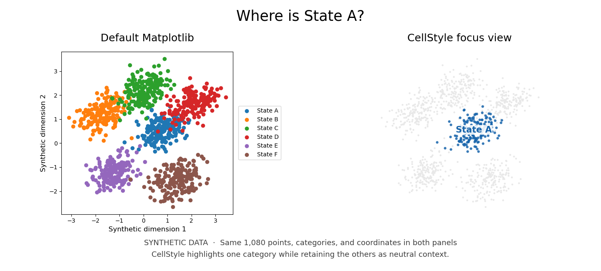
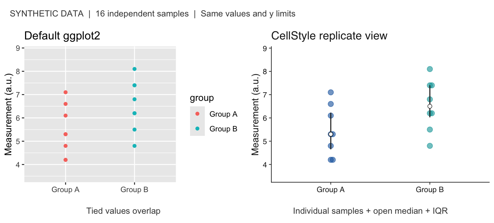

# CellStyle

Consistent scientific plots for researchers working with single-cell data and biological replicates in Python or R.

CellStyle adds clean themes, explicit identity colors, replicate displays, and supplied statistical annotations to familiar plotting workflows. Prefer native Scanpy and Seurat plots when they express your question; apply styling where useful.

## See the difference

Both comparisons use the same synthetic observations on the left and right. They demonstrate plotting behavior, not a biological result.

### Focus on one population (Python)



CellStyle keeps the other states visible as context while drawing attention to the selected state. The coordinates stay fixed. [Reproduce this plot](examples/python_focus_comparison.py).

### Show the individual replicates (R)



The true beeswarm separates overlapping observations; the median and interquartile range remain secondary to the individual values. Both panels use the same y-axis. [Reproduce this plot](examples/r_replicate_comparison.R).

**Provisional source version: 0.2.0.** Install from GitHub `main` using the commands below. This source snapshot is not a stable release or a claim of PyPI/CRAN availability. APIs and visual defaults may change. For reproducible work, record the installed commit and dependency versions; `main` can move.

## Install

Python 3.10 or later:

```bash
python -m pip install "git+https://github.com/nbatada/cellstyle.git@main"
```

Required packages are Matplotlib ≥3.7, NumPy ≥1.24, pandas ≥2.0, seaborn ≥0.13, and adjustText ≥1.1. `adjustText` is a core dependency. For native Scanpy embedding support:

```bash
python -m pip install "cellstyle[scanpy] @ git+https://github.com/nbatada/cellstyle.git@main"
```

R 4.1 or later:

```r
if (!requireNamespace("remotes", quietly = TRUE)) install.packages("remotes")
remotes::install_github(
  "nbatada/cellstyle", ref = "main", subdir = "r/cellstyle",
  upgrade = "never"
)
```

R imports ggplot2 ≥3.5.0 and rlang. Install `ggbeeswarm` for replicate distributions and `ggrepel` for repelled labels as needed.

## Python quickstart

Each synthetic row below represents one biological replicate. Reuse the same explicit identity-to-color mapping in every figure so one biological identity retains one color.

```python
import pandas as pd
import matplotlib.pyplot as plt
import cellstyle as cs

replicates = pd.DataFrame({
    "condition": ["control"] * 3 + ["treated"] * 3,
    "response": [1.1, 1.3, 1.2, 1.8, 1.9, 1.7],
})
identity_colors = {"control": "#1764AB", "treated": "#D43F3A"}

with cs.theme_context("manuscript"):
    ax = cs.replicate_distribution(
        replicates, x="condition", y="response",
        order=["control", "treated"], palette=identity_colors,
    )
    ax.set_ylabel("Response (arbitrary units)")
    plt.show()
```

The plot shows observations, an open median marker, and the interquartile range. CellStyle does not infer biological replication from input rows.

## R quickstart

```r
library(ggplot2)
library(cellstyle)

d <- data.frame(
  condition = rep(c("control", "treated"), each = 3),
  time = rep(1:3, 2),
  response = c(1.1, 1.3, 1.2, 1.8, 1.9, 1.7)
)
identity_colors <- c(control = "#1764AB", treated = "#D43F3A")

p <- ggplot(d, aes(time, response, colour = condition)) +
  geom_point() +
  scale_colour_cellstyle(values = identity_colors) +
  theme_cellstyle("manuscript")
print(p)
```

See the [R user guide](docs/R_BACKEND.md) for replicate distributions, labels, and supplied comparisons.

## Features and limits

| Feature | Available behavior | Limit |
| --- | --- | --- |
| Themes | Exploration, review, manuscript, presentation | Check legibility at the final output size |
| Identity colors | Explicit mappings; Python `ColorRegistry`; five-color palette | Palette and accessibility thresholds are provisional; larger palettes are not comprehensively validated |
| Continuous colors | Positive magnitude and marker-upregulation scales | Marker scale is not a validated general signed-effect palette |
| Replicate distributions | Beeswarm, median, IQR | Caller defines the observation unit; R needs `ggbeeswarm` |
| Scatter and labels | Optional linear fit; repelled labels | Caller justifies a fit; R labels need `ggrepel` |
| Statistical annotations | Render supplied P values or labels | No inferred or computed statistical test; restricted geometry |
| Embeddings | Python categorical and focus helpers | Prefer native Scanpy/Seurat; R Seurat integration remains unvalidated |
| Python/R support | Native Matplotlib and ggplot2 workflows | Rendering and geometry are not guaranteed identical |

Statistical annotations currently target categorical x positions and linear y axes. R rejects unsupported facets, transformations, and fixed limits. Python does not automatically route brackets to facets or avoid all collisions. Inspect annotated output. Effect sizes and confidence intervals require explicit label text to be displayed; result validity remains the caller's responsibility.

## Python API at a glance

- Themes: `set_theme`, `theme_context`
- Colors: `EDITORIAL_VIVID`, `editorial_vivid`, `positive_cmap`, `marker_heatmap_cmap`, `context_color`, `ColorRegistry`
- Plots: `replicate_distribution`, `quantitative_scatter`
- Labels and embeddings: `repel_labels`, `categorical_embedding`, `focus_embedding`
- Supplied comparisons: `ComparisonResult`, `add_comparisons`

Licensed under the [MIT license](LICENSE). Citation metadata is in [CITATION.cff](CITATION.cff).
