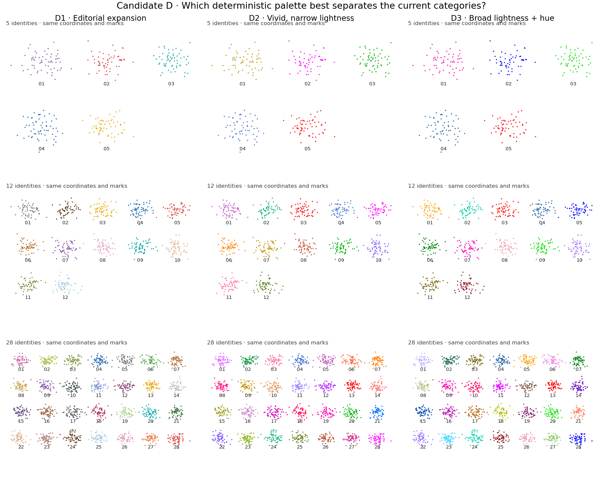

# Candidate D — deterministic allocation for the current category set

Status: D1's editorial direction is selected; the palette is not frozen.
D2/D3 are retired from further development. The active decision is the
[D1a/D1b/D1c focused refinement](EDITORIAL_PALETTE_REFINEMENT.md).
No variant has been installed as a `cs.pl.umap` default. Candidates B and C are retired from
further development; their previous comparison remains historical evidence.

## Contract selected by the scientist

**Same category set → stable mapping.**
**Changed category set → mapping may change.**

Prioritize visual distinction among populations actually present in the plot.
Canonically sort distinct string identities by exact Unicode codepoint order;
case, spacing, and spelling remain part of identity. Use observed nonmissing
identities, not unused categorical levels. Row order, AnnData category order,
Matplotlib's color cycle, and notebook styling/RNG state do not affect allocation.
A future integration must determine the category set after intended filtering.
The same-set guarantee presumes the same selected palette rule/version.

Cross-figure/dataset identity persistence is a separate explicit feature, not a
hashing problem. Supply a named palette or obtain one from `ColorRegistry`:

```python
cs.pl.umap(adata, color="cell_type", palette=identity_colors)

# When using an existing registry:
identity_colors = {name: registry.color(name) for name in displayed_identities}
cs.pl.umap(adata, color="cell_type", palette=identity_colors)
```

The current comparison does not change the registry schema or persistence API.
No identity-name hashing is used in Candidate D. SHA256 in its diagnostics is
only a checksum of the frozen fixture, not a color-assignment mechanism.

## Historical three-variant comparison



[PDF overview](images/categorical-set-candidates.pdf) ·
[Population key](images/categorical-color-key.png) ·
[Mappings and diagnostics](images/categorical-set-metrics.json) ·
[Reproduction script](../examples/categorical_set_candidates.py)

| Variant | Palette/allocation design | Question for visual selection |
| --- | --- | --- |
| D1 — Editorial expansion | Keep the five existing editorial colors; expand from the previous 32-swatch inventory using greedy CIELAB farthest-point selection | Does the familiar, restrained palette remain sufficiently distinct at 12/28 categories? |
| D2 — Vivid, narrow lightness | Select high-chroma gamut colors within a narrow lightness band; greedily maximize distance from already selected swatches | Does stronger hue separation improve discrimination without excessive visual intensity? |
| D3 — Broad lightness + hue | Select from a wider lightness range and allow moderately saturated colors; use the same greedy distance heuristic | Do lightness differences improve dense-category distinction, or do light/dark marks imply unwanted emphasis? |

All variants assign selected swatches to canonically sorted names. D1 constrains
the first five choices to the existing palette; D2/D3 start near its blue and
expand from a fixed quantized sRGB gamut grid. Exact-distance ties use fixed grid
order. Distance is ΔE76 under CIELAB/D65; greedy selection is a heuristic, not a
global optimum, perceptual guarantee, or color-vision deficiency assessment.
The RGB gamut/lightness/chroma constraints differ intentionally between variants.

All three have zero exact swatch repeats at the rendered category counts.
At 28 identities the minimum raw-swatch ΔE76 is 15.5 (D1), 22.1 (D2), and 31.8
(D3). These are diagnostic proxies; they do not rank actual scientist reading
performance. They do not include alpha/background blending, small-point effects,
or color-vision deficiency. Exact distinctness alone does not prove readable
category discrimination.

Comparison scope is up to 32 identities; only 5, 12 and 28 are rendered. Larger
counts require a separate policy and evidence after selection. No accessibility
or manuscript-readiness claim is made.

## Frozen controls and viewing sizes

The exact `synthetic_fixture` generator from the preceding comparison is reused,
with identical seeds (2603 + category count), identities and coordinates. Each
population has 60 observations. Every column has the same point size (12), alpha
(0.9), axis limits, equal aspect, neutral numeric labels, typography, and layout.
The phenotype names are synthetic labels, not biological evidence. The three
fixture checksums are recorded in the metrics JSON.

The overview is a 12 × 9.5 inch figure. To check small marks at a manuscript
viewing condition, the same 28-population panels are also exported at **90 × 70
mm**, without changing the data, palette, or mark settings:

- [D1 PNG](images/categorical-set-D1-90mm.png) / [PDF](images/categorical-set-D1-90mm.pdf)
- [D2 PNG](images/categorical-set-D2-90mm.png) / [PDF](images/categorical-set-D2-90mm.pdf)
- [D3 PNG](images/categorical-set-D3-90mm.png) / [PDF](images/categorical-set-D3-90mm.pdf)

These are controlled color-viewing conditions, not selected future UMAP figure,
label, legend, frame or size defaults.

## Executed checks and stop point

Nine focused checks passed (three variants × three category counts), verifying
stable mapping after reversed rows, reordered categories, added unused levels,
changed color cycle/background/font settings, and repeated calls without RNG
state changes. All variants assign a distinct swatch to every observed category.
The full overview and the 90 mm D3 panel were visually inspected. All PNG/PDF
files were rendered. Package runtime code was unchanged, so no installed-wheel,
R, or broad package suite was rerun locally for this comparison-only checkpoint.

Scientist selection is required before implementation into `cellstyle.pl`.
Select or critique the active D1a/D1b/D1c refinement; D2/D3 are retired. There is no automatic choice based
on the distance numbers. The earlier identity-hash candidates B/C are not part
of this decision.
