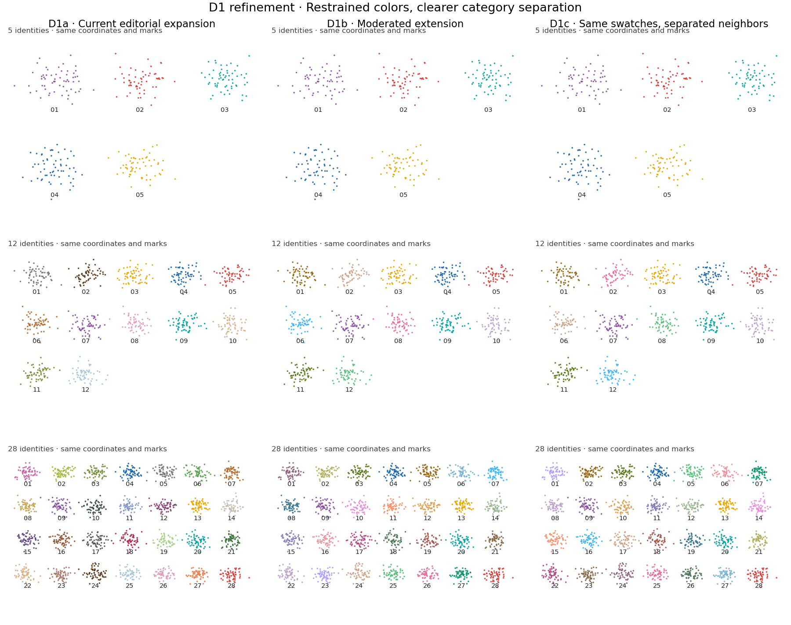
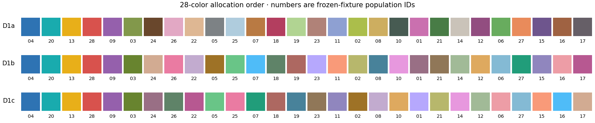

# D1 editorial palette — one focused refinement

**Selected direction:** expanded editorial colors. **Palette decision:** pending
scientist selection. No winner is installed as a package default. D2/D3 are
retired from further development; their old comparison remains historical.

The scientist selected D1 because category colors should distinguish nominal
biological identities without becoming the dominant feature of the figure.
This comparison addresses only palette selection/allocation, with the exact
frozen 5-, 12-, and 28-identity fixtures and preceding graphical controls.

## Three variants

| Variant | Controlled change | Design hypothesis |
| --- | --- | --- |
| D1a — Current D1 | None: exact previous D1 mapping at each category count | Baseline editorial restraint, including its dark/light and near-neutral extension swatches |
| D1b — Refined D1 | Keep the first five anchors; draw extension colors from a moderated lightness/chroma inventory using the same greedy max-min selection | Fewer near-neutral swatches and less lightness spread may make small categories easier to distinguish without excessive saturation |
| D1c — Refined allocation | Exact same selected colors as D1b; reorder only the extension swatches to improve neighboring allocation separation | Separating close hues in allocation order may make palette neighbors easier to identify without a new color vocabulary |

At five categories all variants are **identical** and use the existing five
CellStyle colors unchanged. At larger counts the first five canonical allocation
slots still retain those exact colors and order. This does not preserve a named
identity when the category set changes.

## Compact 28-color allocation strips

Left to right is canonical allocation order. Numbers are the corresponding
frozen-fixture population IDs, so the same number identifies the same population
in the UMAP. Swatches use alpha 0.9 over white, matching the points. The separate
strip does not add legends, spacing, or labels to the UMAP itself.

[Overview PDF](images/editorial-refinement.pdf) ·
[Swatch-strip PDF](images/editorial-swatches-28.pdf) ·
[Population key](images/categorical-color-key.png) ·
[Mappings and diagnostics](images/editorial-refinement-metrics.json) ·
[Reproduction script](../examples/editorial_palette_refinement.py)

## Manuscript-scale viewing

Every panel is exported with the previous **90 × 70 mm** controls, now including
both difficult category counts. These files preserve point size, alpha, labels,
axis geometry, margins and type sizes; print or view the PDFs at physical size.

| Variant | 12 categories | 28 categories |
| --- | --- | --- |
| D1a | [PNG](images/editorial-D1a-12-90mm.png) / [PDF](images/editorial-D1a-12-90mm.pdf) | [PNG](images/editorial-D1a-28-90mm.png) / [PDF](images/editorial-D1a-28-90mm.pdf) |
| D1b | [PNG](images/editorial-D1b-12-90mm.png) / [PDF](images/editorial-D1b-12-90mm.pdf) | [PNG](images/editorial-D1b-28-90mm.png) / [PDF](images/editorial-D1b-28-90mm.pdf) |
| D1c | [PNG](images/editorial-D1c-12-90mm.png) / [PDF](images/editorial-D1c-12-90mm.pdf) | [PNG](images/editorial-D1c-28-90mm.png) / [PDF](images/editorial-D1c-28-90mm.pdf) |

## Selection and allocation mechanics

The set contract remains: **same category set → stable mapping; changed category
set → mapping may change**. Exact Unicode ordering of observed, nonmissing string
identities determines allocation. Unused categorical levels do not participate.
Mapping does not depend on row/category order, Matplotlib color cycle, embedding
geometry, or notebook state. Cross-figure identity persistence stays explicit
through a supplied named palette or `ColorRegistry`, without identity hashing.

D1a reproduces the previous selection from its 32-swatch inventory. D1b's
extension candidates have designed CIELAB/D65 L* values 46–70 and chroma 24–52;
in-gamut colors are quantized to hex. The five original anchors are exempt from
these extension bounds, including the original gold's stronger chroma. Greedy
farthest-point selection starts from those anchors. No near-neutral extensions
or extreme lightness values are selected just to increase nominal separation.

D1c retains D1b's exact selected swatch set and first five slots. A bounded,
deterministic allocation search prefers chromatic separation, penalizes close
hues and large lightness gaps, and improves worst then average neighbor score.
It uses no spatial graph or name hashing. **Allocation neighbors are not
necessarily spatial neighbors in a UMAP.** Optimizing allocation by embedding
geometry would violate the required category-set-only mapping. Global close
pairs therefore remain a separate concern; reordering cannot eliminate them.

The following raw-swatch ΔE76 diagnostics quantify the prototype tradeoffs; they
are heuristics, not scientist reading-performance, perceptual, accessibility or
manuscript-readiness validation. They do not model alpha/background blending.

| Count | Variant | Closest pair, any colors | Closest allocation neighbors | Whole-palette L* range |
| --- | --- | ---: | ---: | --- |
| 12 | D1a | 31.4 | 32.1 | 25.4–78.5 |
| 12 | D1b | 32.5 | 39.7 | 41.6–72.5 |
| 12 | D1c | 32.5 | 53.3 | 41.6–72.5 |
| 28 | D1a | 15.5 | 29.2 | 25.4–79.2 |
| 28 | D1b | 20.9 | 34.0 | 41.6–72.5 |
| 28 | D1c | 20.9 | 47.7 | 41.6–72.5 |

## Frozen controls, checks and stop

Fixture SHA256 checksums match the preceding comparison exactly; D1a mappings
also match the prior saved D1 mapping exactly. Point size 12, alpha 0.9, neutral
population IDs (font size 7), frame removal, equal aspect, axes limits, 12 × 9.5
inch overview, 90 × 70 mm panel sizes and margins are unchanged. Only comparison
headings identify the new variants. No category counts, observation counts,
coordinates or population labels were changed. Each frozen population has 60
observations; the small-region viewing check is not a separate rare-population
sample-size study.

Ten focused checks passed: nine set/order/notebook-state/anchor checks plus a
real render-artist check of retained observations, point size, alpha, annotation
IDs/font size, aspect and limits. Extension gamut bounds and D1b/D1c identical
swatch sets were checked. Overview, allocation strips and the D1c 28-category
90 mm PNG were inspected. All requested PNG/PDF artifacts were generated.
Package runtime code was unchanged; no wheel, R or broad suite was rerun locally.

Scientist selection of D1a, D1b, D1c, or specific critique is the stop point.
There is no package implementation or automatically declared winner yet.
