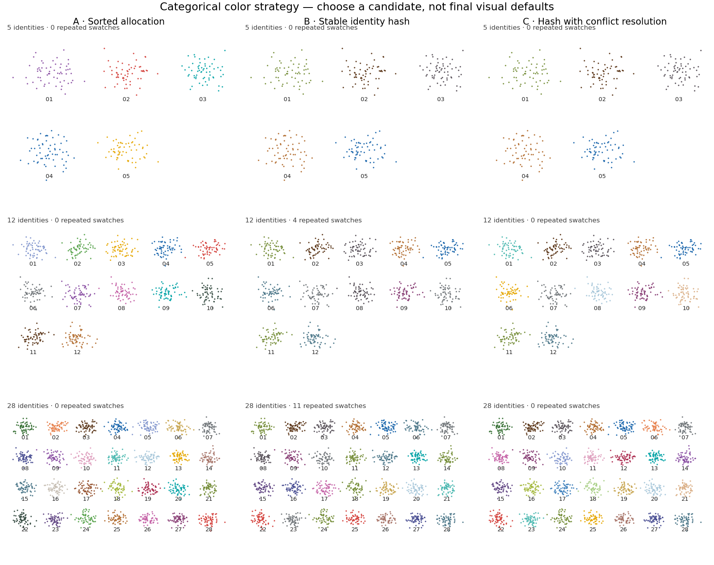

# Scanpy facade V1 — integration and first color decision

Architecture accepted; integration implemented; visual defaults unselected.
Publication-ready claims are not authorized. Base: public CellStyle commit
`3106d78a5704ba94d4e4d07403772ad8369f78e4`. Inputs: the supplied reference zip and
its prior assessment. This work does not change the existing specialized helpers,
R backend, five-color palette, or unrelated local panel-export work.

## Implemented checkpoint

```python
import cellstyle as cs
cs.pl.umap(adata, color="cell_type")
```

The root package exposes `pl` without importing Scanpy. Importing `cellstyle.pl`
also leaves Scanpy unloaded. Requesting a plot attribute loads its native metadata
when Scanpy is available, preserving its inspected signature/docstring; calling
that function requires Scanpy. Without the optional dependency, the name remains
callable with installation guidance on invocation; introspection then has a
generic forwarding signature. The namespace supports autocomplete through `dir`.

All nine documented names are currently compatibility passthroughs: `umap`,
`embedding`, `tsne`, `pca`, `dotplot`, `matrixplot`, `heatmap`, `violin`, and
`stacked_violin`. Unsupported names fail clearly. UMAP is the only next visual
workstream. No blanket positive colormap, point-size rule, layout setting, alpha,
or frame-removal rule is injected before selection. Explicit Scanpy arguments,
exceptions, display/save controls and return values retain native behavior.
No Scanpy monkey-patching or global theme setup is used.

The reference's dead expression-colormap code was omitted. The provisional
frame default was withheld because categorical presentation is the next visual
decision after colors, not a default already accepted in this ticket.

## Active color decision: Candidate D

The scientist has selected **deterministic set-based allocation** as the design
contract: same category set → stable mapping; changed category set → mapping may
change. Cross-dataset persistence is explicit via a supplied palette or registry.
D1's expanded-editorial direction is selected but not frozen. See the
[active D1a/D1b/D1c refinement](EDITORIAL_PALETTE_REFINEMENT.md). D2/D3 and B/C are
retired from further development; no variant is installed as a default.

## Historical A/B/C comparison (superseded)



[Population key](images/categorical-color-key.png) ·
[PDF comparison](images/categorical-color-candidates.pdf) ·
[Mappings and diagnostic counts](images/categorical-color-metrics.json) ·
[Reproduction script](../examples/categorical_color_candidates.py)

Only the mapping strategy varies across columns. The synthetic coordinates,
identities, 60 observations per population, point size, alpha, typography, aspect,
and layout are identical within each row. Numeric annotations identify
populations without adding colored text or competing legends. These annotations
and fixture layouts are comparison controls, not proposed facade defaults.

All candidates share a fixed inventory of 32 qualitative swatches, beginning
with the five existing CellStyle colors. SHA256 is used rather than Python's
process-randomized hash. Every strategy is independent of the notebook color
cycle and of input row/category ordering. They intentionally reveal different
tradeoffs; no candidate is frozen or installed as a default.

| Candidate | Rule | Strength | Limitation |
| --- | --- | --- | --- |
| A | Sort names; allocate swatches in order | No exact repeats up to 32 identities; uses existing five colors for small sets | Adding/removing names can remap existing identities |
| B | Hash each name directly to a swatch | Same name retains its color across category-set changes | Collisions: 4 repeated swatches at 12 identities; 11 at 28 in this fixture |
| C | Hash names; resolve occupied slots in canonical order using free swatches | No exact repeats up to 32 identities; preserves hash assignment where possible | Conflict resolution can remap identities when the category set changes; uses only a prototype RGB-distance heuristic |

At 5 identities all candidates have zero exact repeats. At 28 identities A and
C have zero exact repeats. Distinct hex codes do not establish perceptual
separability. The metrics also record how many remaining identities changed
color when one population was removed; those fixture-specific counts are not
universal stability guarantees. Case, spacing and spelling are distinct IDs.

Practical comparison limit: 32 identities; the script rejects larger sets.
A final rule for larger sets, persisted registry/catalog behavior, grayscale, and
color-vision deficiency handling needs explicit selection and further evidence.
There is no accessibility validation or manuscript-readiness claim.

## Executed checks

- 19 focused facade tests and three retained helper API checks exercised this
  code with Scanpy 1.11.5 on Python 3.11.15. One save-test fixture originally
  failed while restoring Scanpy's property-backed settings; restoration was
  corrected and only the affected test was rerun successfully.
- Assertions cover lazy root/module import, namespace discovery, native function
  destinations, argument forwarding, explicit overrides, caller kwargs,
  missing-dependency guidance, unsupported names, native signature metadata,
  preserved specialized helpers, no rcParams/Scanpy-function mutation, and real
  categorical/continuous two- and four-panel UMAPs.
- Real calls verify supplied ax identity, return_fig, show=True, save output,
  cmap/color_map aliases and explicit normalization/bounds.
- A separately built wheel was installed in an isolated target and checked for
  root namespace discovery and a real UMAP call. The installed core wheel was
  also checked without Scanpy for lazy discovery and actionable invocation error.
- The three candidate renders retain 300, 720, and 1,680 synthetic observations
  per panel and verify order-independent mappings. PNG and PDF were generated;
  the PNG was visually inspected. No private scientific data were used.

Existing CI covers the final branch on Python 3.10/3.13 with Scanpy and the R
package. Remote status should be read for the final commit; prior runs do not
establish this checkpoint's result. No redundant local R/full-package rerun was
needed because R and the existing plotting implementations were unchanged.

## Stop point and unresolved constraints

Scientist selection of Candidate D's palette/allocation variant is required
before any categorical color rule becomes a package default. Other visual decisions remain pending:
categorical presentation, continuous scales, long-label multipanel spacing, and
large-N rasterization. The demonstrated native long-legend overlap and export
policy remain explicit limitations at this checkpoint. A future scoped change
must handle show/save before rendering/saving while preserving Scanpy returns;
postprocessing after Scanpy has already saved would be too late.
